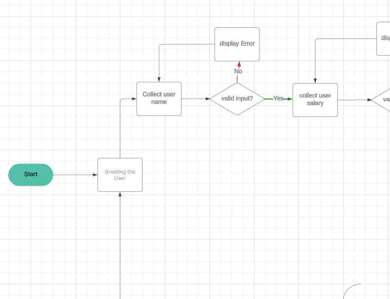
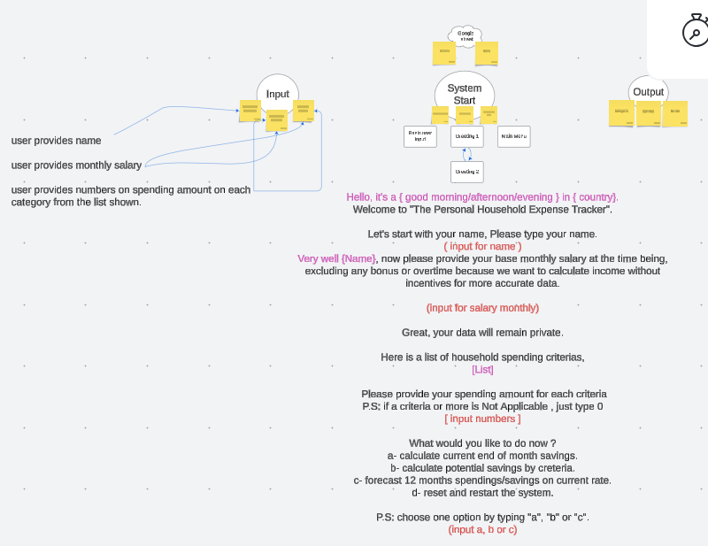

# The Household Expense Tracker

## Table of Contents
1. [Introduction](#introduction)  
2. [Features](#features)  
3. [Target Audience](#target-audience)  
4. [How to Use It](#how-to-use-it)  
5. [Limitations](#limitations)  
6. [Room for Improvement](#room-for-improvement)  
7. [Testing and Debugging](#testing-and-debugging)  
8. [Installation](#installation)  
9. [Usage](#usage)  
10. [Development Process](#development-process)  
11. [Deployment](#deployment)  
12. [Contributing](#contributing)  
13. [License](#license)  

---

## Introduction
The **Personal Household Expense Tracker** is a Python-based command-line application designed to help users manage their monthly expenses and savings. It allows users to input their salary, track spending across predefined categories, and analyze their financial health through features like savings calculation, potential savings analysis, and 12-month forecasting.

## Visual Overview

This section provides visual representations of the project's design and development process to help you understand the workflow and conceptual framework.

### Flowchart
The flowchart outlines the structured and systematic workflow of the project. It represents the logical flow of processes, decision points, and task dependencies, translating conceptual ideas into actionable and executable steps. This diagram serves as a reference for understanding the project's architecture and operational logic.

link: https://lucid.app/lucidchart/0cdb2379-ffe9-4dac-abee-73d746e468e1/edit?viewport_loc=115%2C-241%2C4139%2C2500%2C0_0&invitationId=inv_0a7cc6fc-3db3-4d46-af63-84607c2ee25e




### Mind Map
The mind map captures the initial brainstorming and ideation phase of the project. It is an unstructured and exploratory space where ideas, inspirations, and concepts are freely organized. This visual tool helps in identifying relationships between different components and serves as the foundation for refining and structuring ideas into the flowchart.

link: Link: https://lucid.app/lucidspark/dc677aee-e42e-4469-820b-db2807b9af34/edit?viewport_loc=-7139%2C-514%2C13247%2C7470%2C0_0&invitationId=inv_9c2fad69-7430-4722-ab49-03c1d67ae812




These visuals collectively illustrate the transition from conceptualization to implementation. The mind map represents the creative and exploratory phase, while the flowchart reflects the structured and systematic approach to development. For further details, refer to the relevant sections in the documentation.

---

## Features
1. **User Input Validation**: Collects and validates user input for name, salary, and spending amounts. Handles empty or invalid input data gracefully.  
2. **Expense Tracking**: Predefined spending categories with descriptions. Collects monthly spending data for each category.  
3. **Financial Analysis**:  
   - **Current Savings**: Calculates current monthly and annual savings.  
   - **Potential Savings**: Analyzes how much a user could save by reducing spending in specific categories.  
   - **12-Month Forecasting**: Projects savings and expenses over the next 12 months based on current financial data.  
4. **Data Persistence**: Saves user data to Google Sheets for future reference. Loads user data from Google Sheets based on the user's name.  
5. **User-Friendly Interface**:  
   - **Color-Coded Terminal Output**: Enhances readability with colored text (e.g., red for warnings, green for success messages).  
   - **Sticky Menu**: Allows users to navigate the application easily without returning to the main menu after every action.  
6. **Error Handling**: Implements exception handling to optimize the user experience.  
7. **Menu System**: Provides a clear and intuitive way to interact with the app, including options to save/load data, reset the system, and analyze finances.  

---

## Target Audience
The **Personal Household Expense Tracker** is designed for:  
- **Individuals**: Anyone looking to track and manage their monthly expenses and savings.  
- **Families**: Households that want to plan their finances and identify areas for potential savings.  
- **Budget-Conscious Users**: People who want to gain insights into their financial health and make informed decisions.  
- **Non-Technical Users**: The app is user-friendly and does not require advanced technical knowledge to use.  

---

## How to Use It
1. **Run the Application**:  
   ```bash
   python expense.py
   ```  
2. **Enter Your Information**:  
   - Provide your name and monthly salary.  
   - Input spending amounts for each predefined category (e.g., Housing, Groceries, Transportation).  
3. **Use the Menu**:  
   - **Calculate Current Savings**: View your monthly and annual savings.  
   - **Analyze Potential Savings**: Identify areas where you can reduce spending and calculate potential savings.  
   - **Forecast 12-Month Savings**: Project your savings and expenses over the next year.  
   - **Save/Load Data**: Save your data to Google Sheets or load previously saved data.  
   - **Reset System**: Clear all data and start over.  
   - **Quit**: Exit the application.  

---

## Output Examples for Each Function

### 1. **Greet User**
When the application starts, the user is greeted based on the time of day:

```
Hello, it's a good morning!
Welcome to 'The Personal Household Expense Tracker'.
```

---

### 2. **Collect User Info**
The user is prompted to enter their name and monthly salary:

```
Enter your name: Ali El Haj
Enter your monthly salary (in USD): 3000

Great, your data will remain private.
```

---

### 3. **Display Spending Categories**
The user is shown the predefined spending categories and descriptions:

```
Here's your household spending categories. Take a look at them before providing data:
- Housing: Rent or mortgage payments
- Utilities: Electricity, gas, water, and trash services
- Groceries: Food and household supplies
- Transportation: Fuel, public transport, or vehicle maintenance
- Insurance: Health, home, auto, or life insurance premiums
- Healthcare: Out-of-pocket medical expenses, prescriptions, and dental care
- Childcare/Education: Tuition, daycare, or extracurricular activities for children
- Internet and Phone: Monthly bills for internet service and mobile phone plans
- Entertainment: Subscriptions (like Netflix), dining out, and recreational activities
- Personal Care: Toiletries, haircuts, and other cosmetics

Type 'Y' to continue: Y
```

---

### 4. **Collect Spending**
The user enters their monthly spending for each category:

```
Please enter your monthly spending for each category (enter 0 if not applicable):

Housing: 1000
Utilities: 200
Groceries: 300
Transportation: 150
Insurance: 100
Healthcare: 50
Childcare/Education: 0
Internet and Phone: 100
Entertainment: 200
Personal Care: 50

Spending data collected successfully.
```

---

### 5. **Display Menu**
The user is shown the sticky menu with action options:

```
--- Menu ---
a. Calculate current monthly/annual savings
b. Analyze potential savings by category
c. Forecast 12-month spending/savings
d. Save data to database
e. Load data from database
f. Reset and restart system
g. Quit system
------------

Select an option (a-g): 
```

---

### 6. **Calculate Current Savings**
The application calculates and displays the user's current savings:

```
--- Current Savings ---
Monthly Salary: $3000.00
Monthly Expenses: $2150.00
Monthly Savings: $850.00
-----------------------
Annual Salary: $36000.00
Annual Expenses: $25800.00
Annual Savings: $10200.00
-----------------------
```

---

### 7. **Analyze Potential Savings**
The user selects categories to reduce spending and enters reduction percentages:

```
Select categories to reduce spending:
1. Housing
2. Utilities
3. Groceries
4. Transportation
5. Insurance
6. Healthcare
7. Childcare/Education
8. Internet and Phone
9. Entertainment
10. Personal Care

Enter the numbers of categories (comma-separated): 9
Enter the percentage reduction for Entertainment (e.g., 10 for 10%): 20
Potential savings for Entertainment: $40.00

Total potential savings: $40.00
```

---

### 8. **Forecast Savings**
The application forecasts savings and expenses over the next 12 months:

```
--- 12-Month Forecast ---
Monthly Salary: $3000.00
Monthly Expenses: $2150.00
Monthly Savings: $850.00
-------------------------
Month 1:
  Cumulative Savings: $850.00
  Cumulative Expenses: $2150.00
Month 2:
  Cumulative Savings: $1700.00
  Cumulative Expenses: $4300.00
...
Month 12:
  Cumulative Savings: $10200.00
  Cumulative Expenses: $25800.00
-------------------------
Total Annual Savings: $10200.00
Total Annual Expenses: $25800.00
-------------------------
```

---

### 9. **Save Data**
The user saves their data to the database:

```
Data saved to database: expense_tracker
```

---

### 10. **Load Data**
The user loads their saved data by entering their name:

```
Enter your name to load your data: Ali El Haj
Data loaded successfully!
```

---

### 11. **Reset System**
The user resets the system to clear all data:

```
System reset. Restarting...
```

---

### 12. **Quit System**
The user exits the application:

```
Thank you for using 'The Personal Household Expense Tracker'! Keep tracking and managing your expenses effectively.
```

---

### Example Workflow
Here’s an example of a full user interaction:

```
Hello, it's a good morning!
Welcome to 'The Personal Household Expense Tracker'.

Enter your name: Ali El Haj
Enter your monthly salary (in USD): 3000

Great, your data will remain private.

Here's your household spending categories. Take a look at them before providing data:
- Housing: Rent or mortgage payments
- Utilities: Electricity, gas, water, and trash services
- Groceries: Food and household supplies
- Transportation: Fuel, public transport, or vehicle maintenance
- Insurance: Health, home, auto, or life insurance premiums
- Healthcare: Out-of-pocket medical expenses, prescriptions, and dental care
- Childcare/Education: Tuition, daycare, or extracurricular activities for children
- Internet and Phone: Monthly bills for internet service and mobile phone plans
- Entertainment: Subscriptions (like Netflix), dining out, and recreational activities
- Personal Care: Toiletries, haircuts, and other cosmetics

Type 'Y' to continue: Y

Please enter your monthly spending for each category (enter 0 if not applicable):

Housing: 1000
Utilities: 200
Groceries: 300
Transportation: 150
Insurance: 100
Healthcare: 50
Childcare/Education: 0
Internet and Phone: 100
Entertainment: 200
Personal Care: 50

Spending data collected successfully.

--- Menu ---
a. Calculate current monthly/annual savings
b. Analyze potential savings by category
c. Forecast 12-month spending/savings
d. Save data to database
e. Load data from database
f. Reset and restart system
g. Quit system
------------

Select an option (a-g): a

--- Current Savings ---
Monthly Salary: $3000.00
Monthly Expenses: $2150.00
Monthly Savings: $850.00
-----------------------
Annual Salary: $36000.00
Annual Expenses: $25800.00
Annual Savings: $10200.00
-----------------------

Select an option (a-g): g

Thank you for using 'The Personal Household Expense Tracker'! Keep tracking and managing your expenses effectively.
```

---


## Limitations
1. **Command-Line Interface**: The app is currently limited to a command-line interface, which may not appeal to users who prefer graphical interfaces.  
2. **Google Sheets Dependency**: Data persistence relies on Google Sheets, which requires an internet connection and a Google account.  
3. **Predefined Categories**: The spending categories are fixed and cannot be customized by the user.  
4. **Manual Input**: Users must manually input their spending data, which can be time-consuming.  


---

## Room for Improvement
1. **Graphical User Interface (GUI)**: Develop a GUI to make the app more accessible and visually appealing.  
2. **Customizable Categories**: Allow users to add, remove, or modify spending categories.  
3. **Automated Data Import**: Integrate with bank accounts or financial apps to automatically import spending data.  
4. **Advanced Analytics**: Add features like trend analysis, visualizations (e.g., charts and graphs), and personalized financial recommendations.  
5. **Multi-User Support**: Enable multiple users to track their expenses within the same household.  
6. **Offline Mode**: Add support for offline data storage (e.g., using a local database) for users without consistent internet access.  
7. **Mobile App**: Develop a mobile version of the app for on-the-go expense tracking.  

---

## Testing and Debugging
### What to Look For:
1. **Input Validation**:  
   - Ensure the app handles invalid inputs (e.g., non-numeric salary, negative spending amounts) gracefully.  
   - Test edge cases like empty inputs or extremely large values.  
2. **Financial Calculations**:  
   - Verify that savings, potential savings, and 12-month forecasts are calculated accurately.  
   - Test with different salary and spending values to ensure consistency.  
3. **Data Persistence**:  
   - Confirm that user data is correctly saved to and loaded from Google Sheets.  
   - Test scenarios where the Google Sheets API is unavailable or returns errors.  
4. **Error Handling**:  
   - Ensure the app provides clear error messages and recovers gracefully from exceptions.  
   - Test scenarios like network failures or invalid Google Sheets credentials.  
5. **User Experience**:  
   - Verify that the sticky menu and color-coded output work as intended.  
   - Test the app with non-technical users to identify usability issues.  

### Debugging Tips:
- Use print statements or a debugger to trace the flow of execution and identify issues.  
- Test individual functions in isolation to ensure they work as expected.  
- Monitor API responses and error logs when interacting with Google Sheets.  
- Validate data at each step (e.g., after input collection, before saving to Google Sheets).  

---

## Installation
### Prerequisites
- Python 3.x  
- Google Sheets API credentials (`credentials.json`)  

### Steps
1. Clone the repository:  
   ```bash
   git clone https://github.com/your-username/personal-expense-tracker.git
   ```  
2. Navigate to the project directory:  
   ```bash
   cd personal-expense-tracker
   ```  
3. Install the required libraries:  
   ```bash
   pip install -r requirements.txt
   ```  
4. Place your Google Sheets API credentials (`credentials.json`) in the project directory.  

---

## Usage
1. Run the application:  
   ```bash
   python expense.py
   ```  
2. Follow the on-screen instructions to:  
   - Enter your name and monthly salary.  
   - Input spending amounts for each category.  
   - Use the menu to analyze your finances, save/load data, or reset the system.  

---

## Development Process
The application was developed with a focus on:  
- **Code Readability**: Proper indentation, comments, and meaningful variable names.  
- **Modularity**: Functions are granular and handle specific tasks.  
- **Error Handling**: Ensures a smooth user experience even with invalid inputs.  
- **External Libraries**: Uses libraries like `gspread` for Google Sheets integration and `colorama` for colored terminal output.  

---

## Deployment
The application is deployed on **Heroku**, a cloud-based platform. Deployment steps include:  
1. Creating a Heroku account and installing the Heroku CLI.  
2. Configuring the app for deployment using a `Procfile` and `requirements.txt`.  
3. Pushing the code to Heroku and ensuring it runs correctly.  

---

## Contributing
Contributions are welcome! Please follow these steps:  
1. Fork the repository.  
2. Create a new branch for your feature or bugfix.  
3. Submit a pull request with a detailed description of your changes.  

---

## License
All rights reserved.  
This project is developed from scratch by **Ali El Haj 2025, Berlin, Germany**.  

---

## Conclusion
The **Personal Household Expense Tracker** is a comprehensive tool designed to help users manage their finances effectively. By including all features, such as the **menu system**, **data persistence**, and **financial analysis**, the app provides a robust and user-friendly experience. Thank you for using the app, and we hope it helps you achieve your financial goals!